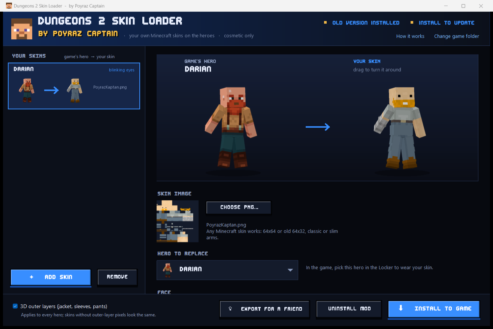

# Dungeons 2 Skin Loader

**by Poyraz Captain** **Only Steam for now**

Put your own Minecraft skins on the heroes of **Minecraft Dungeons II**. Cosmetic only: nothing about gameplay changes.



## Features

- **Any Minecraft skin**: 64×64 or old 64×32, classic or slim arms. The texture is converted to the game's hero layout automatically.
- **Pick the hero to replace**: every hero and Deluxe variant, shown with its original look next to your skin.
- **3D outer layers**: jacket, sleeves and pants stick out in 3D, like in Minecraft.
- **Face options**
  - *As drawn*: your face exactly as in the skin.
  - *Game face*: the game's own animated eyes and brows, coloured from your skin.
  - *Blinking eyes*: your own eye pixels blink in place. Each eye can be on the face or the outer (hat) layer, with its own eyelid colour.
- **Locker icons** rendered in the game's own pose.
- **Colour picker** with an eyedropper for picking colours straight from the skin.
- **Safe installs**: installing detects any earlier version of the mod and replaces it, so there are never two copies. *Uninstall mod* puts the game back to normal.
- **Export for a friend**: a small zip with `INSTALL.bat` / `UNINSTALL.bat`.
- One portable `.exe`, nothing to install (Windows 10/11, .NET Framework 4.x, already part of Windows).

## Download and use

1. Download `Dungeons2SkinLoader.exe` from the [Releases](../../releases) page.
2. Close the game and run the app. It finds Minecraft Dungeons II in your Steam libraries (or use *Change game folder*).
3. Click **Add skin** (or drop skin PNGs on the window), pick a hero and a face option.
4. Click **Install to game**, start the game and pick that hero in the Locker.

Your skins and settings are kept in `Documents\Dungeons 2 Skin Loader`.

Only players who installed the mod see custom skins. To see each other's skins, friends need the same mod (**Export for a friend**).

After a game update the mod may stop loading until a new version of the app is released. **Uninstall mod** always restores the original look.

## How it works (short version)

Minecraft Dungeons II is an Unreal Engine 5 game. The app writes a small mod container (`Paks\~mods\zzz_Dungeons2SkinLoader_P.*`) that the game loads on top of its own files:

- **Hero skins**: the hero's skin texture is replaced with your skin, remapped to the game's model (whose legs and head/hat backs are laid out differently from Minecraft's).
- **Outer layers**: the player model gets extra slightly-larger shells around the body, arms and legs, bound to the same bones. Transparent pixels stay invisible, like the game's hat layer.
- **Blinking eyes**: tiny extra quads in front of each face pixel follow the game's eye bones. They only show where a skin paints their colour pixels, so the game's own heroes are unaffected.
- **Locker icons**: the pose and camera were fitted to the game's official hero icons.

## Building from source

`build.bat` compiles the app with the C# compiler that ships with Windows (no Visual Studio needed):

```
build.bat
```

It needs `data\md2data.bin`, a data file generated from your own copy of the game. It isn't part of this repository; see [`data/README.md`](data/README.md) and [`tools/README.md`](tools/README.md).

## Disclaimer

Fan-made project, **not affiliated with, endorsed by or connected to Mojang Studios or Microsoft**. *Minecraft* and *Minecraft Dungeons* are trademarks of Mojang Synergies AB. This tool only changes how heroes look on your own PC. Use it at your own risk and respect the game's terms, especially in online play.

## Credits

- Made by **Poyraz Captain**.
- Display font: **Edit Undo BRK** by Brian Kent (Ænigma Fonts), a free font.

## License

Source code: [MIT](LICENSE).
